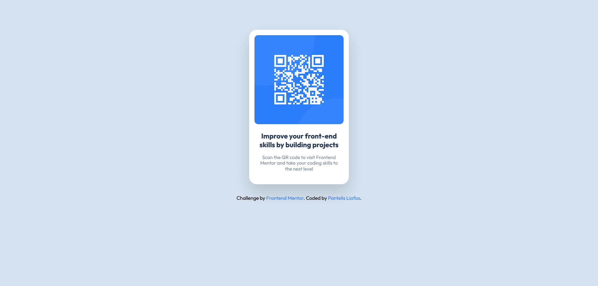

# Frontend Mentor - QR code component solution

This is a solution to the [QR code component challenge on Frontend Mentor](https://www.frontendmentor.io/challenges/qr-code-component-iux_sIO_H). Frontend Mentor challenges help you improve your coding skills by building realistic projects.

## Table of contents

-   [Overview](#overview)
    -   [Screenshot](#screenshot)
    -   [Links](#links)
-   [My process](#my-process)
    -   [Built with](#built-with)
-   [Author](#author)

## Overview

### Screenshot

### Links

-   Solution URL: [https://github.com/paliafas/frontend-mentor-qr-code-component](https://github.com/paliafas/frontend-mentor-qr-code-component)
-   Live Site URL: [https://pl-frontend-mentor-qr-code-component.netlify.app/](https://pl-frontend-mentor-qr-code-component.netlify.app/)

## My process

### Built with

-   React
-   Tailwind CSS

## Author

-   LinkedIn - [Pantelis Liafas](https://www.linkedin.com/in/pantelis-liafas/)
-   Frontend Mentor - [@paliafas](https://www.frontendmentor.io/profile/paliafas)
